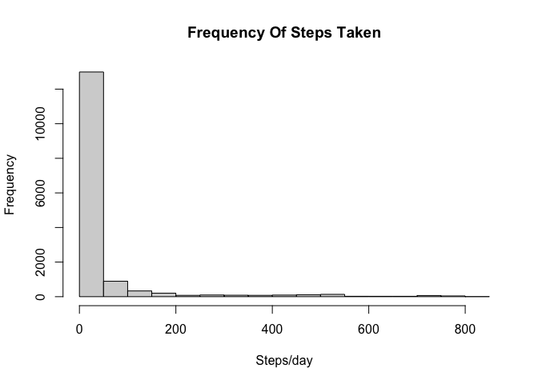
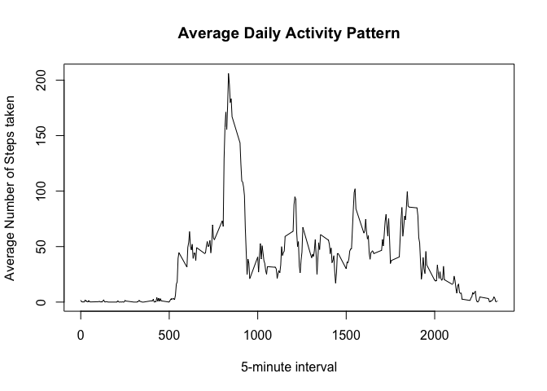
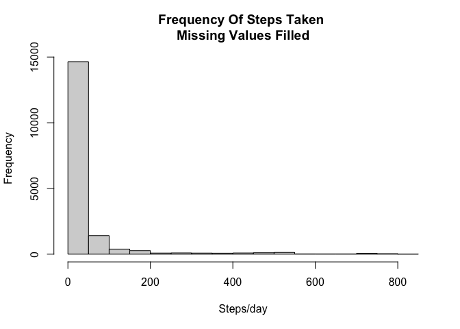
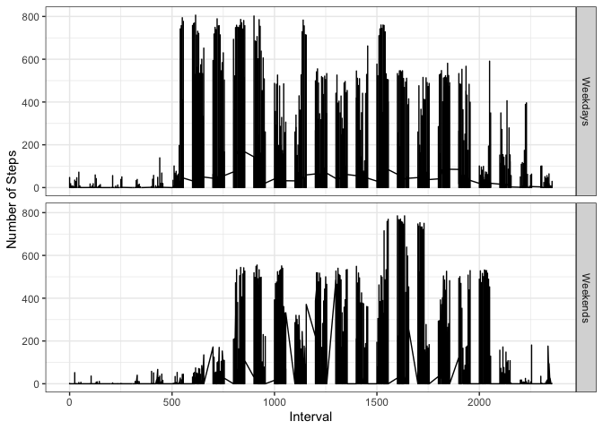

```r
library(dplyr)
```

```
## 
## Attaching package: 'dplyr'
```

```
## The following objects are masked from 'package:stats':
## 
##     filter, lag
```

```
## The following objects are masked from 'package:base':
## 
##     intersect, setdiff, setequal, union
```

```r
library(lubridate)
```

```
## 
## Attaching package: 'lubridate'
```

```
## The following objects are masked from 'package:base':
## 
##     date, intersect, setdiff, union
```

```r
library(ggplot2)
```


## Loading and Preprocessing the Data


```r
data <- read.csv("activity.csv")
```

## Report on Mean and Steps Taken Per Day

### Histogram of Number of Steps Taken Each Day


```r
hist(data$steps[!is.na(data$steps)], main = "Frequency Of Steps Taken", xlab = "Steps/day")
```

<!-- -->

### Mean and Median of Steps Taken Daily


```r
avg = mean(data$steps, na.rm = TRUE)
mdn = median(data$steps, na.rm = TRUE)
```
The mean of steps taken daily is: 37.3825996 and the mean is: 0


## Average Daily Activity Pattern


```r
data_avg = data %>% 
  select(steps, interval) %>%
  group_by(interval) %>%
  summarize(AvgStep = mean(steps, na.rm = TRUE)) %>%
  data.frame
```

```
## `summarise()` ungrouping output (override with `.groups` argument)
```

```r
plot(data_avg$interval, data_avg$AvgStep, type = "l", main = "Average Daily Activity Pattern", 
     xlab = "5-minute interval",  ylab = "Average Number of Steps taken")
```

<!-- -->


### Maximum Number of Steps by Minute Interval


```r
maximum <- max(data_avg$AvgStep)
interval <- data_avg$interval[data_avg$AvgStep ==  max(data_avg$AvgStep)]
```

The 5-minute interval with the maximum number of steps taken daily on average is: 835 and the maximum is: 206.1698113

## Missing Values

### Total Number of Missing Values Across All Days


```r
missingDaily = sum(is.na(data$steps))
```

The total number of missing values across all days is: 2304

### Filling for Missing Values


```r
new_data <- data
new_data$steps[is.na(new_data$steps)] <- with(data_avg, AvgStep[match(new_data$interval, interval)])
```

```
## Warning in new_data$steps[is.na(new_data$steps)] <- with(data_avg,
## AvgStep[match(new_data$interval, : number of items to replace is not a multiple
## of replacement length
```

## Figures Without Missing Values


```r
complete_avg = mean(new_data$steps)
complete_mdn = median(new_data$steps)
hist(new_data$steps, main = "Frequency Of Steps Taken \nMissing Values Filled", xlab = "Steps/day")
```

<!-- -->


The mean and median without missing values of steps taken daily are: 37.3825996 and 0 respectively. It can be seen that filling for missing values doesn't chage these values from the ones estimated before.

## Differences in Activity Patterns Between Weekdays and Weekends


```r
new_data$date <- ymd(new_data$date)
new_data <- mutate(new_data, Factors = weekdays(date))
new_data$Factors  <- ifelse(new_data$Factors %in% c("Saturday", "Sunday"), "Weekends", "Weekdays")
new_data$Factos <- factor(new_data$Factors)
theme_set(theme_bw())
qplot(x=interval, y=steps, data= new_data, facets= Factors~.,
  xlab="Interval", ylab="Number of Steps", geom = "line")
```

<!-- -->
